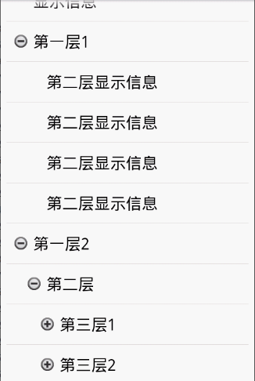

Android TreeTest Project
==============================

这是一个根据listview做的androidTree.

Description
-----------
这是一个根据listview而不是expandlistview做的可点开扩展的树形机构。效果图如下：

Developed By
------------
* wedcel（王威威） - <wedcel@163.com>

License
-------

    Copyright 2012 Evgeny Shishkin
    
    Licensed under the Apache License, Version 2.0 (the "License");
    you may not use this file except in compliance with the License.
    You may obtain a copy of the License at
    
    http://www.apache.org/licenses/LICENSE-2.0
    
    Unless required by applicable law or agreed to in writing, software
    distributed under the License is distributed on an "AS IS" BASIS,
    WITHOUT WARRANTIES OR CONDITIONS OF ANY KIND, either express or implied.
    See the License for the specific language governing permissions and
    limitations under the License.

[1]: http://cyrilmottier.com/media/2012/07/the-making-of-prixing-4-activity-tied-notifications/toast_user_flow_fail.png
[2]: http://cyrilmottier.com/media/2012/07/the-making-of-prixing-4-activity-tied-notifications/in_layout_notification.png
[3]: http://i46.tinypic.com/21kywit.png
